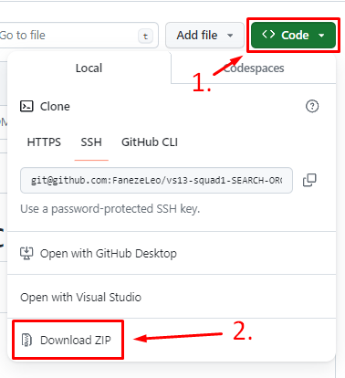

## :bookmark: Índice

- [Sobre o Projeto](#information_source-sobre-o-projeto)
- [Como Utilizar](#books-como-utilizar)
- [Autores](#smile-autores)
## :information_source: Sobre o projeto
O projeto __Seach Organic__ busca diminuir os custos e o desperdício relacionados a produtos naturais, sem prejudicar a rentabilidade dos produtores. Esse objetivo será alcançado por meio de um site que estabelece a conexão direta entre o produtor e o consumidor final, proporcionando uma experiência de busca orgânica por produtos frescos e sustentáveis. A ideia principal é facilitar a busca por alimentos cultivados de maneira orgânica diretamente dos produtores locais, promovendo uma conexão direta entre quem produz e quem consome.

## :books: Como utilizar:
Pode efetuar o download a partir de um browser: <br>

<br>
É necessário ter o Git instalado para esse tipo de download<br>
Você pode obter uma cópia do projeto através do comando: <br>

```bash
git clone https://github.com/FanezeLeo/vs13-squad1-SEARCH-ORGANIC.git
```
.

Basta abrir o arquivo `Search_Organic.pdf` dentro da pasta `src` e escolher o navegador de sua preferência.

- Acesso a aplicação backend: acesso na pasta /backend/search-organic
- Acesso a aplicação frontend: em desenvolvimento.
- Acesso ao script de criação do banco de dados: pasta /db/criar.sql
- Acesso ao diagrama do banco de dados: pasta /modulo-02/documentos/ER.pdf

## :smile: Autores
| [<br><sub>Alessandra Mariana</sub>](https://github.com/AlessandraMariana) | [<br><sub>André Felipe</sub>](https://github.com/andr3felipe) | [<br><sub>Daniel Ângelo</sub>](https://github.com/danielangelo1) |  [<br><sub>Deyvid Lucas</sub>](https://github.com/DeyvidLucas-DEV) |  [<br><sub>Gabriel Souza</sub>](https://github.com/Gabrieltupi) | [<br><sub>Gregori Nunes</sub>](https://github.com/gregsnn) | [<br><sub>Leonardo Faneze</sub>](https://github.com/FanezeLeo) | [<br><sub>Vitor Colombo</sub>](https://github.com/VitorColombo) |  [<br><sub>Wladmir Rodriuges</sub>](https://github.com/getwlad) |
| :---: | :---: | :---: | :---: | :---: |:---------------------------------------------------------------------------------------------------------------------------------------------------:|:-----------------------------------------------------------------------------------------------:|:-------------------------------------------------------------------------------------------------------------------------------------------------------:| :---: |
