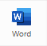

# Search Organic

## Squad 1:

#### Alessandra Mariana de Souza (Q.A)

#### André Felipe (Front-end)

#### Deyvid Lucas da Cunha Amroim (Back-End)

#### Daniel Morais (Front-end)

#### Gabriel Souza (Back-End)

#### Grégori Nunes (Q.A)

#### Leonardo Faneze Camboim (Back-End)

#### Vitor Colombo Nunes (Q.A)

#### Wladmir Rodrigues (Back-End)

 

## Sobre o projeto:

#### O projeto Seach Organic busca diminuir os custos e o desperdício relacionados a produtos naturais, sem prejudicar a rentabilidade dos produtores. Esse objetivo será alcançado por meio de um site que estabelece a conexão direta entre o produtor e o consumidor final.

 

## Como utilizar:

### 1. Faça o download do nosso repositório.

### 2. Extraia os arquivos, se houver problemas nesse passo você pode baixar e instalar o https://www.win-rar.com/predownload.html?&L=9.

2.1. Após baixar e instalar o WINRAR, clique com o botão direito no repositório baixado no passo <strong>( 1 )</strong> e depois em "Extrair aqui".

### Acesso ao arquivo SEARCH_ORGANIC.pdf

Basta abrir o arquivo e escolher o navegador de sua preferência.

### Acesso ao arquivo SEARCH_ORGANIC.docx

### Visualize online:

2. Acesse https://www.office.com/ e faça o login com o seu e-mail ou crie uma conta.
3. Após estar logado, no canto esquerdo da tela procure por  e clique com o botão esquerdo.
4. Agora no canto direito da sua tela procure por  clique com o botão esquerdo e abra o arquivo baixado.

### OU

### Baixe e instale o pacote Microsoft 365 (antigo Office 365):

https://www.microsoft.com/pt-br/microsoft-365
